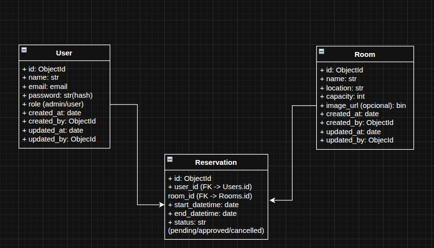

# Sistema de Reservas de Salas de Aula (Backend)

Backend para gerenciar reservas de salas de aula.

## Objetivo

Permitir o cadastro e a gestão de:
- usuários (admin e usuário)
- salas
- reservas com período, status e vínculo entre usuário e sala

Este projeto implementa a lógica principal para criação, acompanhamento e controle de reservas.

## Diagrama de Entidades

